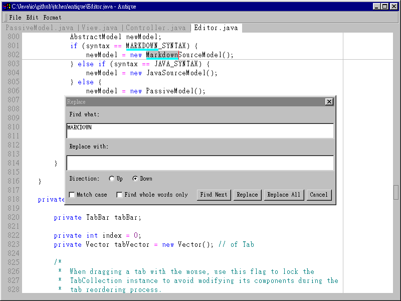

# Antique

Antique is a Java-based text/code editor that can be fully operated using __AWT__ and __Java 1.1 API__.

Therefore, Antique can be run in very early Java runtime environments, and even in the legendary Microsoft Java Virtual Machine provided by Internet Explorer 4:

## Features

Antique intends to mimic most of the editing functions and keyboard shortcuts of Notepad. Besides, the following functions have been added:

- Multiple undo and redo
- Tabbed document interface
- Ability to specify a character encoding
- Syntax highlighting: Java and Markdown

Some functions beyond Java 1.1 have also been implemented using Java reflection:

- Mouse wheel support
- On-the-spot input when using input methods

In addition, when using a monospaced font, Antique always sets the width of Chinese characters to twice the width of English letters. Users can also choose to specify different fonts for Chinese and English.

## Usage

The latest compiled binary file can be downloaded here: [antique.jar](antique.jar). You can double-click the file or use the command line to run it:

    java -jar antique.jar

A list of command line arguments can be obtained in the following way:

    java -jar antique.jar -h

Most keyboard shortcuts can be found on menu items. Exceptions are listed here:

- `Ctrl-T`: open a new tab
- `Ctrl-Tab`, `Ctrl-Shift-Tab`: go to the next or previous tab
- `F3`, `Shift-F3`: repeat the last find in down or up direction
- `Ctrl-U`, `Ctrl-Shift-U`: make the selected text all lowercase or uppercase
- `Ctrl-J`: join two or more contiguous lines

When finding or replacing texts, the matched phrases will be highlighted. Press the `ESC` key to cancel the highlighting.

## License

Antique is released as __CAREWARE__. You can use and copy it at will, but you are encouraged to make a donation for needy children in your country or any part of the world.

Disclaimer: Antique is distributed in the hope that it will be useful, but __WITHOUT ANY WARRANTY__.
